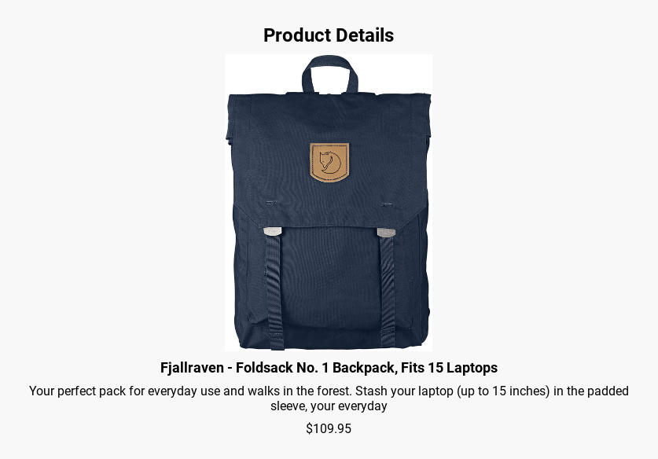

# Product Slider Web Application

**Introduction:**
The Product Slider Web Application is a responsive web-based product slider that allows users to explore a collection of products and view detailed information for each product. It features an intuitive user interface and a seamless shopping experience.

**Technologies Used:**
- React
- React Router
- react-slick (for the carousel)
- HTML/CSS
- JavaScript
- Fetch API (for data retrieval)

**Installation:**
To run the project locally, follow these steps:

1. Clone the repository to your local machine:
git clone https://github.com/thakiddx/shoppingCartApp
cd shoppingCartApp
2. Install dependencies:
npm install
3. Start the development server:
npm start
4. Open your web browser and navigate to [http://localhost:3000](http://localhost:3000) to view the app.

The app is also deployed on [GitHub Pages](https://thakiddx.github.io/shoppingCartApp/).

## Unsolved Problems

At the moment, there are no known unsolved issues with the app. It is fully functional and provides a smooth shopping experience.

## Future Enhancements

Here are some future features and enhancements planned for the project:

- User authentication: Implement user accounts and authentication for a personalized shopping experience.
- Shopping cart improvements: Enhance the shopping cart functionality, including the ability to remove items and change quantities.
- Product reviews: Allow users to leave reviews and ratings for products.
- Payment processing: Integrate a payment gateway for real transactions.
- Product categories: Implement product categorization and filtering.

We welcome contributions from the open-source community to help us improve and expand the app's functionality.

## Hosted App

You can access the hosted working app on [GitHub Pages](https://thakiddx.github.io/shoppingCartApp/).

Feel free to explore the app, shop for products, and enjoy a seamless shopping experience!
